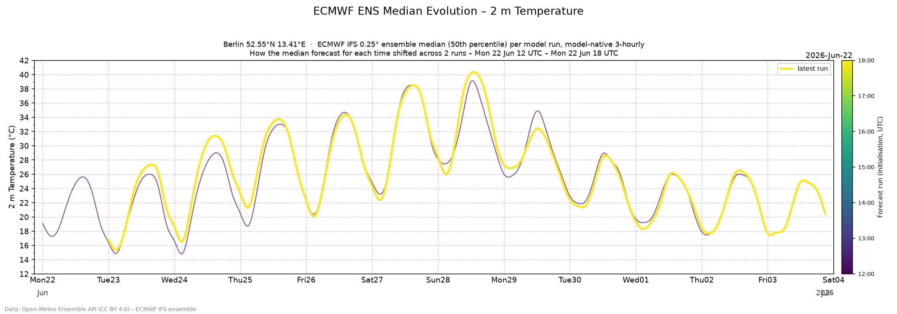

# Ensemble 2 m temperature meteogram

Reproduces the **2 m temperature** panel of an ECMWF-style ENS meteogram using
data fetched from the [Open-Meteo Ensemble API](https://open-meteo.com/en/docs/ensemble-api),
at each model's **native** temporal resolution.


## What it does

* Fetches an **ensemble model** for a single point. The default is the
  **ECMWF IFS 0.25° ensemble** (`ecmwf_ifs025`); the site also offers
  **ECMWF AIFS 0.25°** (`ecmwf_aifs025`), **NOAA GEFS 0.25°**
  (`ncep_gefs025`) and **DWD ICON-EU EPS** (`icon_eu_eps`). The set of models
  lives in `MODELS` in [`data/collect.py`](data/collect.py); add one there to
  grow the archive and the site's model selector.
* Uses **all the ensemble members** the model returns — the control forecast
  plus the perturbed members (e.g. 51 total for ECMWF IFS, 31 for NOAA GEFS).
* Requests `temporal_resolution=native`, the model's own step (3-hourly for the
  ECMWF/GFS models, hourly for the ICON models) across the whole forecast
  horizon (Open-Meteo otherwise interpolates everything to 1-hourly).
* Computes the ensemble percentile distribution at each time step and draws an
  ECMWF-style **box-and-whisker** plot with the control forecast overlaid.

### Box-and-whisker convention

This matches [ECMWF's own meteograms](https://confluence.ecmwf.int/display/FUG/Section+8.1.4+Meteograms):

| Element            | Meaning                                   |
| ------------------ | ----------------------------------------- |
| wide grey box      | 25th–75th percentile (interquartile range)|
| narrow grey box    | 10th–25th and 75th–90th percentiles       |
| horizontal bar     | median (50th percentile)                  |
| thin whisker line  | minimum and maximum across the ensemble   |
| blue line          | control forecast                          |

## Model-comparison plot

A **model-comparison** ("integration") plot draws the **ensemble median of each
model's latest run on a single axis**, one colour-coded line per model, so the
models can be compared at a glance for a given city. It depends only on the
selected city (each line spans its own model's horizon and native step), and
sits above the per-model figures below.

## Median-evolution plot

A further plot shows **how the ensemble median for each time has shifted from
one model run to the next** — the "is the forecast converging?" view.



Each line is one archived run's median (50th percentile across the members),
drawn against valid time and **colour-coded by the run's initialisation time**
(see the colorbar); the most recent run is drawn boldest, on top. Unlike the
box-and-whisker meteogram — which renders the single latest run — this plot is
built from **every run in the [`data` branch](#raw-data-archive-data-branch)
archive**, so it fills in and gets more informative as runs accumulate (a new
ECMWF run roughly every 6 h).

## Usage

```bash
pip install -r requirements.txt

# Default: Berlin (52.55°N, 13.41°E), ECMWF IFS ensemble
python meteogram.py

# A different ensemble model (see MODELS in data/collect.py)
python meteogram.py --model gfs_ensemble025 --output berlin_gefs.png

# Any location, with an optional name / station height in the title
python meteogram.py --latitude 48.21 --longitude 16.37 --name Vienna \
    --output vienna.png

# Render the figure in Czech (labels and date names); English is the default
python meteogram.py --lang cs --output vienna_cs.png

# Keep the raw API response for inspection / offline re-plotting
python meteogram.py --save-json response.json
```

Run `python meteogram.py --help` for all options (`--model`, `--latitude`,
`--longitude`, `--name`, `--station-height`, `--forecast-days`, `--output`,
`--lang`, `--save-json`).

## Notes on fidelity vs. the operational product

* Open-Meteo serves the ECMWF ensemble on a **0.25° grid (~25 km)**; the
  operational ECMWF meteogram uses the native **~9 km** ENS. The requested
  point is therefore snapped to the nearest grid cell (coarser still for some
  models), so fine-scale and elevation-dependent details differ slightly.
* Temperatures are taken as Open-Meteo returns them for the grid cell's model
  elevation; no additional station-height lapse-rate reduction is applied (the
  official product reduces to the station height, typically a sub-0.1 °C
  effect for small height differences).
* The distribution is computed over **all members, control included**, which is
  the ECMWF convention.

## Automated deployment

A single [GitHub Actions workflow](.github/workflows/pages.yml) collects data,
builds the site, and deploys it, in four jobs:

* **fetch** — checks out the [`data` branch](#raw-data-archive-data-branch) and
  fetches a fresh raw API response **only when the model's latest run isn't
  already archived** (it checks the run metadata first); otherwise it quits
  early. New data is committed and pushed to the `data` branch (keyed by run, so
  each run is stored once). See [`data/collect.py`](data/collect.py).
* **build** — checks out the `data` branch and renders the plots from the
  **latest archived data** (no live fetching) for **every archived city × model**
  in **both English and Czech**, embedding them into a small **bilingual** static
  site ([`site/template.html`](site/template.html)), and uploads the artifacts.
  The page is laid out **city → model-comparison plot → model → ensemble &
  history plots**: a top-level **city dropdown** drives everything (and the
  city-level comparison plot), and a **model dropdown** above the per-model
  figures selects which model's ensemble/history is shown. Both switch
  client-side (no page reload); a model with no data for a city is disabled for
  it, and both selections are remembered across the language switch. English is
  served as `index.html` (the site default) and Czech as `cs.html`; each page
  links to the other, and each combination gets its own figures
  (`integration.<city>.<lang>.png`, `meteogram.<city>.<model>.<lang>.png`,
  `evolution.<city>.<model>.<lang>.png`) with localised labels, titles, and date
  names. The cities mirror `LOCATIONS` and the models `MODELS` in
  [`data/collect.py`](data/collect.py).
* **deploy-pages** — publishes to **GitHub Pages** with `actions/deploy-pages`,
  on the production triggers only: every **three hours**
  (`cron: "0 */3 * * *"`), on every **push to `main`**, and on demand via
  **manual dispatch** (the *Run workflow* button).
* **deploy-cloudflare** — on every **pull request**, deploys to **Cloudflare
  Pages** as a *branch deployment*, so each PR gets its own dedicated preview at
  a stable per-branch alias (`https://<branch>.jhrmnn-weather.pages.dev`). The
  URL is posted as a comment on the PR and updated on every push.

Splitting **fetch** from **build** means the slow, rate-limited API call is
throttled to at most once an hour and the archived raw data is the single source
of truth the site renders from.

### Enabling GitHub Pages

Set **Settings → Pages → Build and deployment → Source** to **GitHub Actions**
once; subsequent runs publish automatically.

### Enabling Cloudflare previews

1. Create a **Cloudflare Pages** project (Workers & Pages → Create → Pages →
   *Direct Upload*). The project name is hardcoded as `jhrmnn-weather` in the
   `pages deploy` command in `pages.yml`; change it there if you use a
   different name.
2. Add two **repository secrets** (Settings → Secrets and variables → Actions):
   * `CLOUDFLARE_API_TOKEN` — a token with the *Cloudflare Pages → Edit*
     permission.
   * `CLOUDFLARE_ACCOUNT_ID` — your account ID (Workers & Pages → right
     sidebar).

Forked-PR runs are skipped automatically, since GitHub doesn't expose secrets
to them.

## Raw data archive (`data` branch)

The **fetch** job above builds up a historical archive of the **raw API
responses** on a dedicated orphan branch called `data` (kept off `main`, so the
code history stays clean). The **build** job renders the site from it.

* [`data/collect.py`](data/collect.py) fetches the raw Open-Meteo response for
  each configured location **and model** and stores it under
  `<model>/<lat>_<lon>/<run-init-time>.json` — the API payload as-is, plus a
  `model_run_time` stamp (the run's UTC initialisation time, read from the
  model's static metadata, since the payload itself carries no run timestamp).
* Files are **keyed by the run's initialisation time**, so each model run is
  archived exactly once.
* Fetching is **gated on the run metadata**: `collect.py` reads the model's
  latest run timestamp first and only downloads the ensemble when that run isn't
  already archived, so it **commits & pushes only when there is genuinely new
  data** — and never hits the heavy ensemble endpoint otherwise.
* All fetching lives in `data/collect.py`; [`meteogram.py`](meteogram.py) only
  parses and plots, and the `build` job renders from the archive.

Browse it with `git fetch origin data && git switch data`, or add locations or
models by extending `LOCATIONS` / `MODELS` in `data/collect.py`.

## Data & licence

Forecast data from the [Open-Meteo Ensemble API](https://open-meteo.com/)
(CC BY 4.0), based on **ECMWF, NOAA and DWD ensemble models** (CC BY 4.0).
