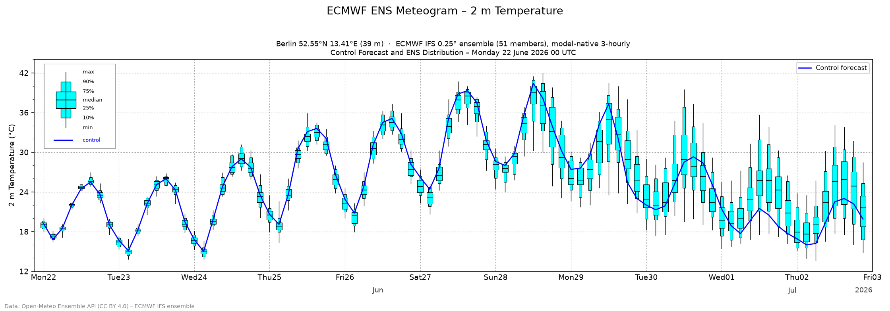

# ECMWF ENS 2 m temperature meteogram

Reproduces the **2 m temperature** panel of an ECMWF ENS meteogram using data
fetched from the [Open-Meteo Ensemble API](https://open-meteo.com/en/docs/ensemble-api),
at the model's **native 3-hourly** resolution.



## What it does

* Fetches the **ECMWF IFS 0.25° ensemble** (`ecmwf_ifs025`) for a single point.
* Uses all **51 members** — the control forecast plus 50 perturbed members.
* Requests `temporal_resolution=native`, which for the ECMWF IFS ensemble is
  **3-hourly across the whole forecast horizon** (Open-Meteo otherwise
  interpolates everything to 1-hourly).
* Computes the ensemble percentile distribution at each time step and draws an
  ECMWF-style **box-and-whisker** plot with the control forecast overlaid.

### Box-and-whisker convention

This matches [ECMWF's own meteograms](https://confluence.ecmwf.int/display/FUG/Section+8.1.4+Meteograms):

| Element            | Meaning                                   |
| ------------------ | ----------------------------------------- |
| wide cyan box      | 25th–75th percentile (interquartile range)|
| narrow cyan box    | 10th–25th and 75th–90th percentiles       |
| horizontal bar     | median (50th percentile)                  |
| thin whisker line  | minimum and maximum across the ensemble   |
| blue line          | control forecast                          |

## Usage

```bash
pip install -r requirements.txt

# Default: Berlin (52.55°N, 13.41°E), 11-day forecast
python meteogram.py

# Any location, with an optional name / station height in the title
python meteogram.py --latitude 48.21 --longitude 16.37 --name Vienna \
    --output vienna.png

# Keep the raw API response for inspection / offline re-plotting
python meteogram.py --save-json response.json
```

Run `python meteogram.py --help` for all options (`--latitude`, `--longitude`,
`--name`, `--station-height`, `--forecast-days`, `--output`, `--save-json`).

## Notes on fidelity vs. the operational product

* Open-Meteo serves the ECMWF ensemble on a **0.25° grid (~25 km)**; the
  operational ECMWF meteogram uses the native **~9 km** ENS. The requested
  point is therefore snapped to the nearest 0.25° grid cell, so fine-scale and
  elevation-dependent details differ slightly.
* Temperatures are taken as Open-Meteo returns them for the grid cell's model
  elevation; no additional station-height lapse-rate reduction is applied (the
  official product reduces to the station height, typically a sub-0.1 °C
  effect for small height differences).
* The distribution is computed over all 51 members (control included), which is
  the ECMWF convention.

## Automated deployment

A single [GitHub Actions workflow](.github/workflows/pages.yml) builds the site
and deploys it, in three jobs:

* **build** — always runs. `python site/build.py` fetches fresh data, renders
  the plot, and embeds it into a small static page
  ([`site/template.html`](site/template.html)), then uploads the result as
  artifacts.
* **deploy-pages** — publishes to **GitHub Pages** with `actions/deploy-pages`,
  on the production triggers only: every **three hours**
  (`cron: "0 */3 * * *"`), on every **push to `main`**, and on demand via
  **manual dispatch** (the *Run workflow* button).
* **deploy-cloudflare** — on every **pull request**, deploys to **Cloudflare
  Pages** as a *branch deployment*, so each PR gets its own dedicated preview at
  a stable per-branch alias (`https://<branch>.jhrmnn-weather.pages.dev`). The
  URL is posted as a comment on the PR and updated on every push.

### Enabling GitHub Pages

Set **Settings → Pages → Build and deployment → Source** to **GitHub Actions**
once; subsequent runs publish automatically.

### Enabling Cloudflare previews

1. Create a **Cloudflare Pages** project (Workers & Pages → Create → Pages →
   *Direct Upload*). The project name is hardcoded as `jhrmnn-weather` in the
   `pages deploy` command in `pages.yml`; change it there if you use a
   different name.
2. Add two **repository secrets** (Settings → Secrets and variables → Actions):
   * `CLOUDFLARE_API_TOKEN` — a token with the *Cloudflare Pages → Edit*
     permission.
   * `CLOUDFLARE_ACCOUNT_ID` — your account ID (Workers & Pages → right
     sidebar).

Forked-PR runs are skipped automatically, since GitHub doesn't expose secrets
to them.

## Raw data archive (`data` branch)

A separate [data-collection workflow](.github/workflows/data.yml) builds up a
historical archive of the **raw API responses** on a dedicated orphan branch
called `data` (kept off `main`, so the code history stays clean).

* [`data/collect.py`](data/collect.py) fetches the raw Open-Meteo response for
  each configured location and stores it **verbatim** under
  `<model>/<lat>_<lon>/<reference-date>_<hash>.json`.
* Files are **keyed by a content hash**, so an unchanged model run is never
  archived twice — re-fetching the same data is a no-op.
* The workflow runs every six hours (and on demand). It checks out the `data`
  branch (creating it on the first run), collects, and **commits & pushes only
  when there is genuinely new data**.

Browse it with `git fetch origin data && git switch data`, or add locations by
extending `LOCATIONS` in `data/collect.py`.

## Data & licence

Forecast data from the [Open-Meteo Ensemble API](https://open-meteo.com/)
(CC BY 4.0), based on the **ECMWF IFS ensemble** (ECMWF data, CC BY 4.0).
